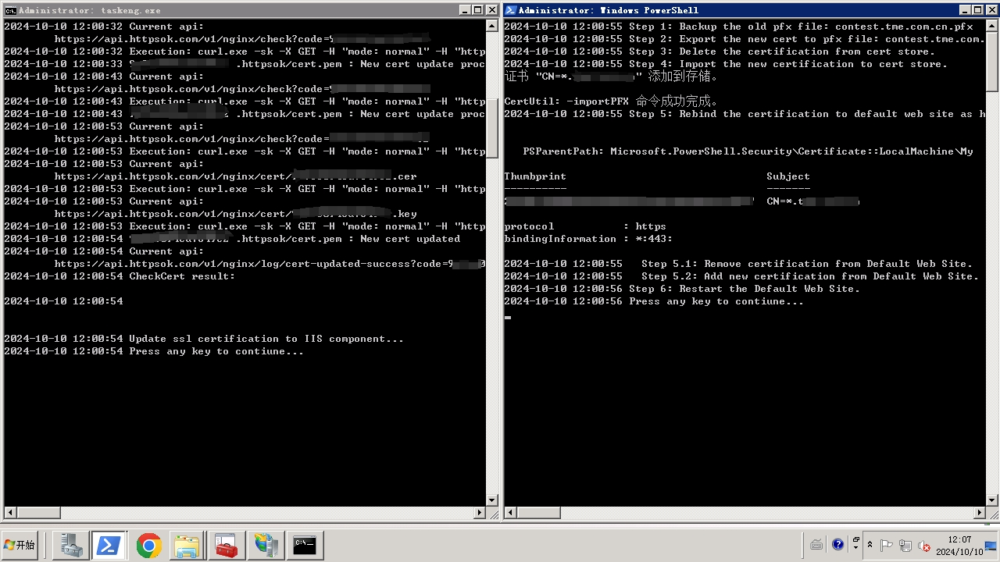

# httpsok_update_on_win

Update SSL cert based on httpsok server automatically on Windows server via PowerShell script.

Main entry:
- HttpsOK_Update_Cert.bat
    Need to input the domain and httpsok's key code when first used.

IIS Web Site update (based on httpsok update):
- CreateAndImportSSLCertification.bat

